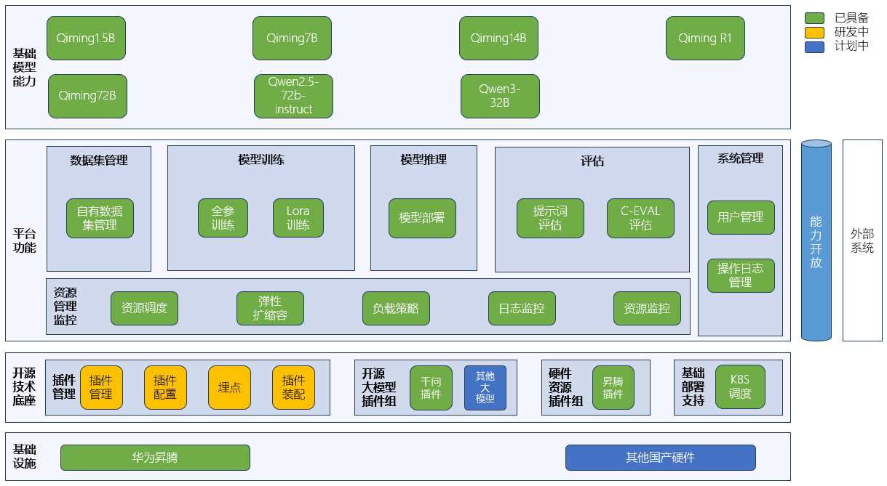
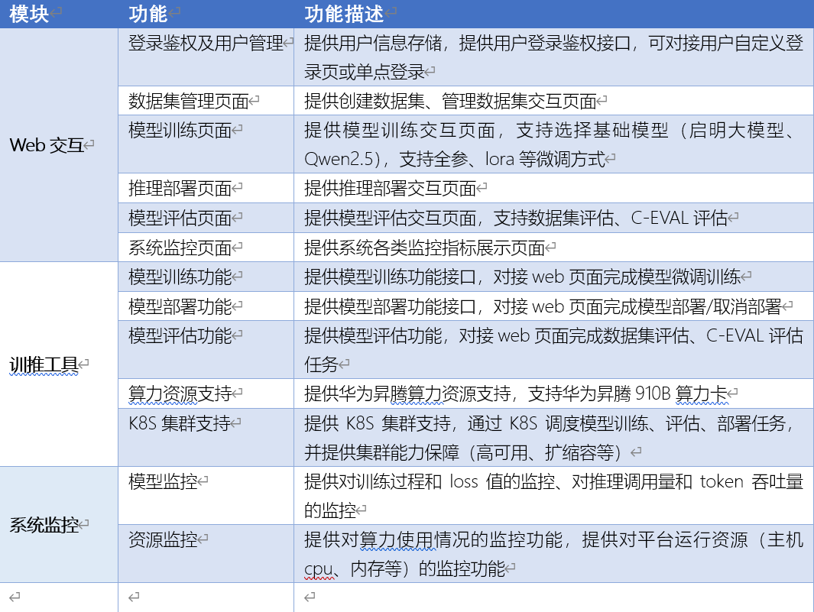

# OpenQiming-TrainInference（启明大模型训推工具链平台项目）

## 🎯 下载
项目地址：https://github.com/OpenQiming/OpenQiming-TrainInference.git

## 🛠️ 项目子模块

| 子模块                            | 名称     | 内容                  |
|--------------------------------|--------|---------------------|
| OpenQiming-TrainInference-web | web前端  | 提供可视化web交互界面        |
| OpenQiming-TrainInference-backend | 后端工程   | 提供后端服务，对接前端完成训推操作   |
| OpenQiming-TrainInference-engine | 任务调度引擎 | 通过接口提供训推任务调度，通过k8s对任务进行管理 |

## 🏗️ 功能架构

## 📄 功能清单

## 🚀 快速开始
1. [搭建web工程](tool_chain_front_vue/README.md)
2. [搭建后台工程](tool_chain_back_java/README.md)
3. [搭建任务调度环境](xtp-traininfer-engine/README-K8S.md)
4. [搭建调度引擎](xtp-traininfer-engine/README.md)

## 📚 开发指南
1. [调度引擎开发指南](xtp-traininfer-engine/README.md#📚-开发者指南)

## 📞 支持
如需支持和问题咨询，请联系开发团队。